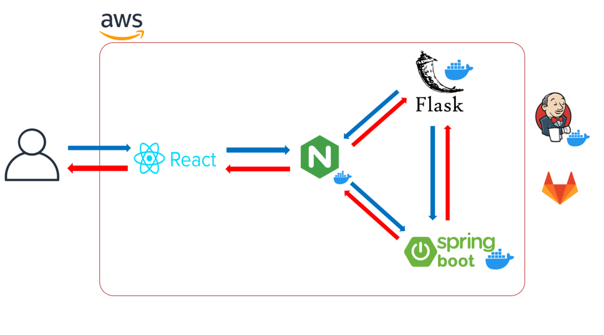
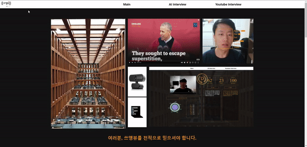
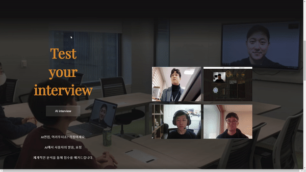
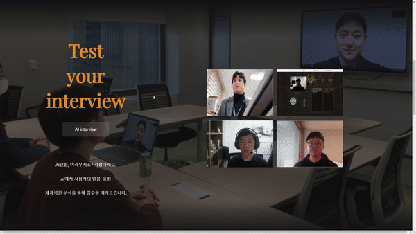
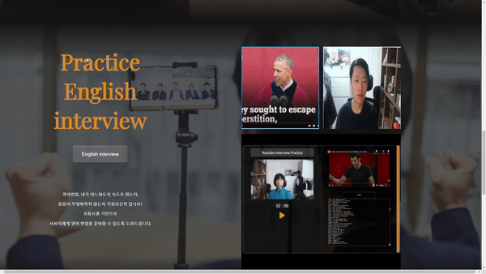

# 쓰앵뷰


> AI 혹은 영어 면접 및 유튜브 활용 스피치 연습 플랫폼

AI 면접에서 진행되는 게임은 없으나 최근 비대면 화상 면접이 늘어난 만큼 화상회의 연습과 AI 면접 모두 대비할 수 있는 서비스이다. 이외에도 유튜브 활용 및 영어 면접에도 활용할 수 있다. 

완료가 되면 감정분석 및 STT(Sppech-To-Text)를 통해 자가체크를 할 수 있도록 결과 리포트를 제공한다. 


서비스 URL : https://k5b103.p.ssafy.io/


## 1. 주요 기능

| 구분 | 기능                    | 설명                                                         |
| ---- | ----------------------- | ------------------------------------------------------------ |
| 1    | 한/영 AI 면접 연습 기능 | 사용자가 Script를 작성을 하고, 한/영 STT(Speech-To-Text) 지원을 통해 면접 평가를 진행한다. |
| 2    | AI 면접 시 얼굴 인식    | 얼굴 인식을 이미지를 캡쳐 후 감정분석을 실시한 결과를 보여준다 |
| 3    | 유튜브 활용 영어 연습   | 인기있는 TED 유튜브 영상 및 영어 자막을 활용하여 일종의 쉐도잉 연습을 진행한다. |


## 2. 구조도





## 3. 설치 예시


#### FrontEnd


```bash
cd frontend
npm install
npm start
```


#### BackEnd


```bash
cd backend/src/main
InterviewApplication run 
```


## 4. 사용 예시

**[메인 화면]**



**[ AI 면접 - 한국어]**




**[ AI 면접 - 영어 ]**




**[ Youtube 영어 연습 ]**




## 5. 팀원 소개 

| 이름         | 역할 | 구현                                    |
| ------------ | ---- | --------------------------------------- |
| 신형식(팀장) | F/E  | STT 기능 구현                           |
| 양준서       | F/E  | Youtube를 통한 영어 면접 연습 기능 구현 |
| 정종우       | F/E  | AI 면접 기능 구현                       |
| 천주용       | B/E  | STT스크립트 유사도 출력                 |
| 김백준       | B/E  | 감정분석 기능 구현                      |

